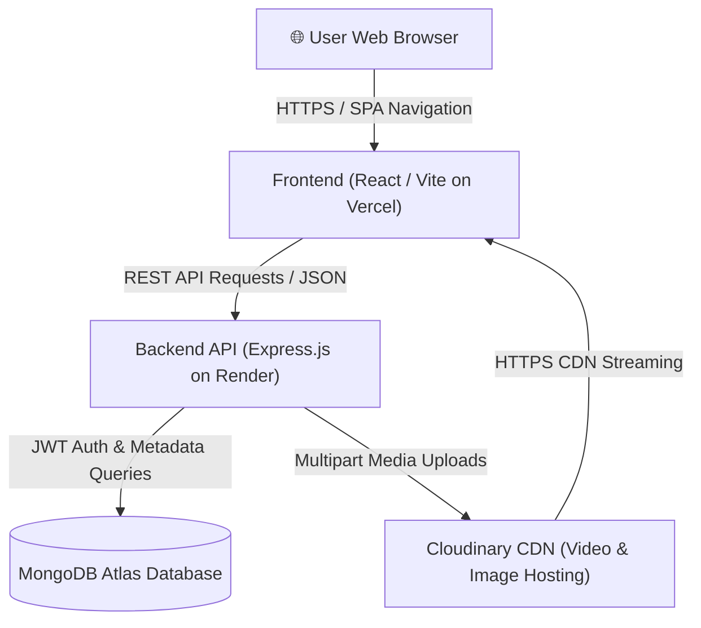
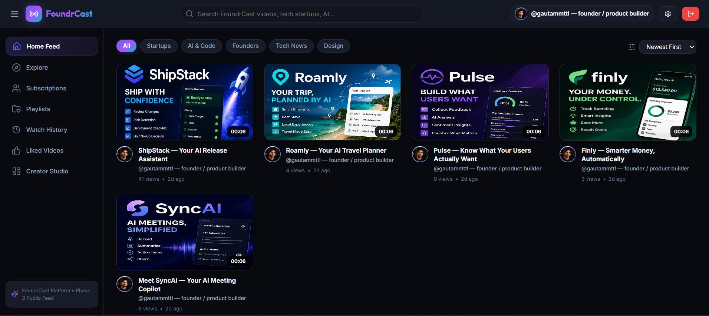

# FoundrCast

> A production-grade full-stack video and creator platform designed for startup founders to showcase product walkthroughs, engage audience feedback, and build creator channels.

[](https://foundr-cast.vercel.app/)
[](https://foundrcast.onrender.com)
[](https://documenter.getpostman.com/view/41863970/2sBXirhnZn)
[](https://app.eraser.io/workspace/YtPqZ1VogxGy1jzIDkzj)
[](#license)

---

## Overview

**FoundrCast** is a complete, full-stack video platform featuring a modern glassmorphic React single-page application backed by a Node.js/Express REST API.

Whether presenting short-form UI demos, product updates, or deep-dive technical masterclasses, FoundrCast equips creators and founders with a rich video streaming experience, social engagement tools (likes, comments, subscriptions), custom playlists, and a dedicated Creator Studio.

- **Frontend App**: [https://foundr-cast.vercel.app/](https://foundr-cast.vercel.app/)
- **Production Backend**: [https://foundrcast.onrender.com](https://foundrcast.onrender.com)
- **API Documentation**: [Postman Collection Documenter](https://documenter.getpostman.com/view/41863970/2sBXirhnZn)

---

## Core Features

### 🎬 Video Experience & Player
- **Custom HTML5 Video Player**: Custom timeline scrubbing, volume controls, mute toggle, duration formatting, and fullscreen support.
- **View Counting**: Single view increment per video playback load to prevent double-counting.
- **Feed & Discovery**: Paginated home video feed, category discovery chips (`Explore`), and related video suggestions on the Watch Page.
- **Debounced Live Search**: Real-time video search with URL state persistence (`?q=`) without browser history pollution.

### 👤 Creator Channels & Profiles
- **Creator Channel Pages (`/channel/:username`)**: Custom channel header banner, avatar, subscriber counts, and aggregated video listings for any creator.
- **Subscription Engine**: Real-time channel subscribe/unsubscribe toggle with instant badge and count updates.

### 💬 Social & Engagement Layer
- **Video Likes**: Like/unlike videos with instant UI update and personal Liked Videos collection (`/liked`).
- **Threaded Comments**: Fetch, post, edit, and delete video comments with owner controls and comment liking.

### 📚 Library & Playlists
- **Custom Playlists**: Create, view, edit, and delete personal playlists (`/playlists`).
- **Save to Playlist Modal**: Add or remove any video to/from user playlists directly from the Watch Page.

### 🛠️ Creator Studio
- **Channel Dashboard (`/studio`)**: Overview metrics displaying Total Views, Subscribers, Total Likes, and Published Video count.
- **Upload Flow**: Multipart video and thumbnail upload with real-time percentage progress bar (`0% - 100%`).
- **Video Management**: Update video details, replace thumbnails, toggle Public/Private visibility, and delete videos with ownership verification.

### 🔒 Auth & Session Management
- **JWT Token Rotation**: Dual token architecture (short-lived Access Tokens, long-lived Refresh Tokens).
- **Cross-Site Cookie Security**: Configured HTTP-only `sameSite: "none"` and `secure: true` cookies for production Vercel-to-Render communication.
- **Silent 401 Interceptor**: Axios interceptor automatically handles background token refreshes without interrupting the user session.

---

## System Architecture



---

## Repository Structure

```
FoundrCast/
├── Backend/               # Node.js / Express.js REST API server
│   ├── src/
│   │   ├── controllers/   # Resource business logic (user, video, comment, like, subscription, playlist...)
│   │   ├── db/            # MongoDB database connection initializer
│   │   ├── middlewares/   # JWT authentication & Multer upload middleware
│   │   ├── models/        # Mongoose schemas (User, Video, Comment, Like, Subscription, Playlist...)
│   │   ├── routes/        # Express REST API routes
│   │   └── utils/         # Cloudinary SDK client, AsyncHandler, ApiError, ApiResponse
│   └── package.json
├── frontend/              # React 18 / Vite Single Page Application
│   ├── src/
│   │   ├── api/           # Axios HTTP client & service endpoints
│   │   ├── components/    # Reusable UI components (Navbar, VideoCard, VideoPlayer, Modals...)
│   │   ├── context/       # Auth & Toast state context providers
│   │   ├── hooks/         # Custom hooks (useAuth, useToast)
│   │   ├── pages/         # Application routes (HomePage, WatchPage, ChannelPage, StudioPage...)
│   │   └── utils/         # Date/view formatters & HTTPS media URL normalization
│   └── package.json
└── docs/                  # Architecture specs & phase implementation plans
```

---

## Tech Stack

| Domain | Technology | Purpose |
|---|---|---|
| **Frontend Framework** | React 18 + Vite | SPA architecture & fast build bundling |
| **Routing & Client** | React Router v6 + Axios | Client-side routing & HTTP request client |
| **Styling & UI** | Custom Vanilla CSS | Glassmorphism design system & responsive layouts |
| **Icons** | Lucide React | Modern vector UI iconography |
| **Backend Runtime** | Node.js (ES Modules) | Asynchronous server execution |
| **API Framework** | Express.js (v5) | RESTful API routing & controller handlers |
| **Database & ORM** | MongoDB + Mongoose | Schema validation & aggregation pipelines |
| **Authentication** | JSON Web Tokens (JWT) + bcrypt | Token authentication & password hashing |
| **Media Storage** | Cloudinary SDK + Multer | Video and thumbnail uploads, processing & CDN delivery |
| **Hosting & Infra** | Vercel (Frontend), Render (Backend), MongoDB Atlas | Production deployment infrastructure |

---

## Engineering Highlights

- **JWT Access & Refresh Token Rotation**: Implemented dual-token session management stored in secure HTTP-only cookies to prevent XSS vulnerability vectors.
- **Automatic Token Refresh Interceptor**: Standardized Axios response interceptors catch 401 Unauthorized errors, issue silent refresh requests to `/users/refresh-token`, and seamlessly retry failed requests.
- **Dynamic Media HTTPS Normalization**: Custom frontend URL parser automatically upgrades legacy HTTP Cloudinary URLs (`http://res.cloudinary.com`) to HTTPS (`https://res.cloudinary.com`), preventing browser mixed-content warnings on production Vercel SSL deployments.
- **In-Place Debounced Routing**: Live search typing updates URL search parameters using `{ replace: true }`, enabling shareable query links (`/?q=keyword`) without creating redundant browser history states.
- **Upload Progress Callbacks**: Multer and Cloudinary uploads report real-time percentage progress (`onUploadProgress`) to provide responsive user feedback during video publishing.

---

## Deployment Configuration

- **Frontend Application**: Deployed on **Vercel** with automatic HTTPS and single-page app rewrite configuration.
- **Backend API Server**: Deployed on **Render** Web Service executing Node.js native ES modules.
- **Database**: Managed **MongoDB Atlas** cluster with indexed collections and aggregation pipelines.
- **Media Delivery**: **Cloudinary** CDN with secure SSL streaming delivery.

---

## Known Limitation

> [!NOTE]
> **Watch History Tracking**: The frontend application fully integrates with `GET /api/v1/users/history` to render watch history records (`/history`). Currently, the backend controller does not automatically push viewed video IDs to the user's `watchHistory` array upon video playback. Watch history read support is fully integrated on the client, while automated history writing remains a planned backend feature.

---

## Local Setup Instructions

### Prerequisites
- Node.js 18+ installed
- A running MongoDB Atlas instance or local MongoDB URI
- A Cloudinary account (Cloud Name, API Key, API Secret)

### 1. Clone the Repository
```bash
git clone https://github.com/gautam-mttl/FoundrCast.git
cd FoundrCast
```

### 2. Backend Setup
```bash
cd Backend
npm install
```

Create a `.env` file in `Backend/`:
```env
PORT=8000
CORS_ORIGIN=http://localhost:5500
MONGODB_URI=mongodb+srv://<username>:<password>@cluster0.mongodb.net

ACCESS_TOKEN_SECRET=your_access_token_secret_key
ACCESS_TOKEN_EXPIRY=1d

REFRESH_TOKEN_SECRET=your_refresh_token_secret_key
REFRESH_TOKEN_EXPIRY=10d

CLOUDINARY_CLOUD_NAME=your_cloudinary_cloud_name
CLOUDINARY_API_KEY=your_cloudinary_api_key
CLOUDINARY_API_SECRET=your_cloudinary_api_secret
```

Start the Backend dev server:
```bash
npm run dev
```

### 3. Frontend Setup
In a new terminal window:
```bash
cd frontend
npm install
```

Create a `.env` file in `frontend/`:
```env
VITE_API_BASE_URL=http://localhost:8000/api/v1
```

Start the Frontend dev server:
```bash
npm run dev
```
Open `http://localhost:5500` in your browser.

---

## Screenshots

### Home Feed & Video Discovery


### Video Watch Page & Custom Player


### Discussion & Threaded Comments
.png)

### Creator Channel Profile


### Creator Studio & Channel Management


---

## License

Licensed under the **ISC License**.
