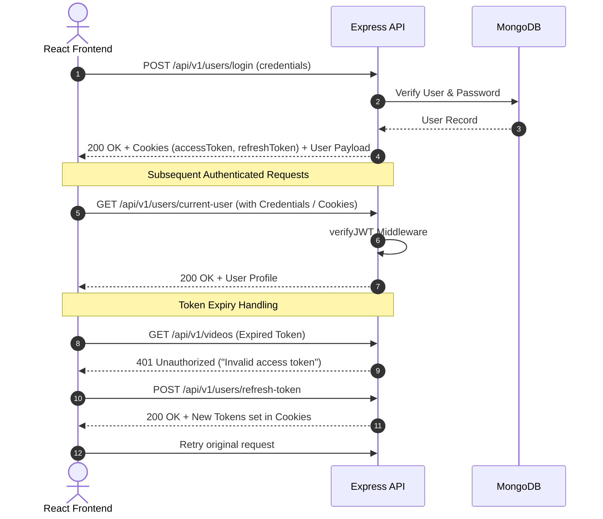

# 02 Definitive API Contract

> **FoundrCast API Version**: `v1`  
> **Base URL**: `/api/v1`  
> **Transport**: HTTP/1.1 or HTTP/2 over TLS (Production) / HTTP (Local Development)

---

## 1. Response & Error Envelopes

All HTTP responses from the backend adhere strictly to standardized JSON response envelopes.

### 1.1 Success Response Envelope (`ApiResponse`)
```json
{
  "statusCode": 200,
  "data": {},
  "message": "Human-readable success message",
  "success": true
}
```
- `statusCode` (Number): HTTP status code mirror (200, 201).
- `data` (Object | Array): Primary response payload.
- `message` (String): Descriptive operational status message.
- `success` (Boolean): Always `true` for status codes `< 400`.

### 1.2 Error Response Envelope (`ApiError`)
```json
{
  "success": false,
  "message": "Human-readable error description",
  "errors": []
}
```
- `success` (Boolean): Always `false`.
- `message` (String): Error explanation message.
- `errors` (Array): Detailed field-level error messages or validation stacks if available.

---

## 2. Authentication & Session Management

Authentication uses Dual JWT Tokens (Access Token + Refresh Token).

### Token Delivery Mechanics
1. **Cookies**: Set automatically by server on login/refresh via `res.cookie()` with `httpOnly: true, secure: true`.
2. **Authorization Header**: Supported via `Authorization: Bearer <accessToken>`.



---

## 3. Paginated Response Structure

All endpoints utilizing `mongoose-aggregate-paginate-v2` (`getAllVideos`, `getVideoComments`, `getChannelVideos`) return data inside the `data` field with this exact shape:

```json
{
  "docs": [],
  "totalDocs": 42,
  "limit": 10,
  "page": 1,
  "totalPages": 5,
  "pagingCounter": 1,
  "hasPrevPage": false,
  "hasNextPage": true,
  "prevPage": null,
  "nextPage": 2
}
```

---

## 4. Endpoint Contracts by Module

### 4.1 User Module (`/api/v1/users`)

#### `POST /api/v1/users/register`
- **Request Headers**: `Content-Type: multipart/form-data`
- **Multipart Fields**:
  - `fullName` (Text, Required)
  - `email` (Text, Required)
  - `username` (Text, Required)
  - `password` (Text, Required)
  - `avatar` (File, Required, maxCount: 1)
  - `coverImage` (File, Optional, maxCount: 1)
- **Response `201 Created`**:
  ```json
  {
    "statusCode": 200,
    "data": {
      "_id": "64f1a2b3c4d5e6f7a8b9c0d1",
      "username": "creator",
      "email": "creator@foundrcast.com",
      "fullName": "Creator Name",
      "avatar": "https://res.cloudinary.com/.../avatar.jpg",
      "avatar_publicId": "foundrcast/avatars/...",
      "coverImage": "https://res.cloudinary.com/.../cover.jpg",
      "coverImage_publicId": "foundrcast/covers/...",
      "createdAt": "2026-08-12T10:00:00.000Z",
      "updatedAt": "2026-08-12T10:00:00.000Z"
    },
    "message": "User registered Successfully lol",
    "success": true
  }
  ```
- **Error Codes**: `400 Bad Request` (Missing required text/file fields), `409 Conflict` (Username or email exists).

---

#### `POST /api/v1/users/login`
- **Request Headers**: `Content-Type: application/json`
- **Body**:
  ```json
  {
    "username": "creator",
    "email": "creator@foundrcast.com",
    "password": "secretPassword123"
  }
  ```
  *(Note: Send either `username` or `email`, alongside `password`)*
- **Response `200 OK`**:
  ```json
  {
    "statusCode": 200,
    "data": {
      "user": {
        "_id": "64f1a2b3c4d5e6f7a8b9c0d1",
        "username": "creator",
        "email": "creator@foundrcast.com",
        "fullName": "Creator Name",
        "avatar": "https://res.cloudinary.com/...",
        "coverImage": "https://res.cloudinary.com/..."
      },
      "accessToken": "eyJhbGciOi...",
      "refreshToken": "eyJhbGciOi..."
    },
    "message": "User logged In Successfully!!",
    "success": true
  }
  ```
- **Error Codes**: `400 Bad Request` (Missing credentials/password), `404 Not Found` (User non-existent), `401 Unauthorized` (Invalid password).

---

#### `POST /api/v1/users/logout`
- **Auth**: Required (`verifyJWT`)
- **Body**: Empty
- **Response `200 OK`**:
  ```json
  {
    "statusCode": 200,
    "data": {},
    "message": "User logged Out",
    "success": true
  }
  ```

---

#### `POST /api/v1/users/refresh-token`
- **Body**: (Optional if cookie present)
  ```json
  {
    "refreshToken": "eyJhbGciOi..."
  }
  ```
- **Response `200 OK`**:
  ```json
  {
    "statusCode": 200,
    "data": {
      "accessToken": "eyJhbGciOi...",
      "newRefreshToken": "eyJhbGciOi..."
    },
    "message": "Access token refreshed",
    "success": true
  }
  ```
- **Error Codes**: `401 Unauthorized` (Token expired or tampered).

---

#### `POST /api/v1/users/change-password`
- **Auth**: Required (`verifyJWT`)
- **Body**:
  ```json
  {
    "oldPassword": "currentPassword123",
    "newPassword": "newSecurePassword456"
  }
  ```
- **Response `200 OK`**:
  ```json
  {
    "statusCode": 200,
    "data": {},
    "message": "Password changed successfully",
    "success": true
  }
  ```
- **Error Codes**: `401 Unauthorized` (Incorrect old password).

---

#### `GET /api/v1/users/current-user`
- **Auth**: Required (`verifyJWT`)
- **Response `200 OK`**:
  ```json
  {
    "statusCode": 200,
    "data": {
      "_id": "64f1a2b3c4d5e6f7a8b9c0d1",
      "username": "creator",
      "email": "creator@foundrcast.com",
      "fullName": "Creator Name",
      "avatar": "https://...",
      "coverImage": "https://..."
    },
    "message": "Current user fetched successfully",
    "success": true
  }
  ```

---

#### `PATCH /api/v1/users/update-account`
- **Auth**: Required (`verifyJWT`)
- **Body**:
  ```json
  {
    "fullName": "Updated Creator Name",
    "email": "updated@foundrcast.com"
  }
  ```
- **Response `200 OK`**:
  ```json
  {
    "statusCode": 200,
    "data": {
      "_id": "64f1a2b3c4d5e6f7a8b9c0d1",
      "username": "creator",
      "email": "updated@foundrcast.com",
      "fullName": "Updated Creator Name",
      "avatar": "https://...",
      "coverImage": "https://..."
    },
    "message": "Account details updated successfully",
    "success": true
  }
  ```
- **Error Codes**: `400 Bad Request`, `409 Conflict` (Email already taken).

---

#### `PATCH /api/v1/users/avatar`
- **Auth**: Required (`verifyJWT`)
- **Multipart File**: `avatar` (Single file)
- **Response `200 OK`**:
  ```json
  {
    "statusCode": 200,
    "data": {
      "_id": "64f1a2b3c4d5e6f7a8b9c0d1",
      "avatar": "https://res.cloudinary.com/.../new-avatar.jpg",
      "avatar_publicId": "foundrcast/avatars/new"
    },
    "message": "Avatar image updated successfully",
    "success": true
  }
  ```

---

#### `PATCH /api/v1/users/cover-image`
- **Auth**: Required (`verifyJWT`)
- **Multipart File**: `coverImage` (Single file)
- **Response `200 OK`**:
  ```json
  {
    "statusCode": 200,
    "data": {
      "_id": "64f1a2b3c4d5e6f7a8b9c0d1",
      "coverImage": "https://res.cloudinary.com/.../new-cover.jpg",
      "coverImage_publicId": "foundrcast/covers/new"
    },
    "message": "Cover image updated successfully",
    "success": true
  }
  ```

---

#### `GET /api/v1/users/c/:username`
- **Auth**: Required (`verifyJWT`)
- **Params**: `username`
- **Response `200 OK`**:
  ```json
  {
    "statusCode": 200,
    "data": {
      "_id": "64f1a2b3c4d5e6f7a8b9c0d1",
      "fullName": "Creator Name",
      "username": "creator",
      "email": "creator@foundrcast.com",
      "avatar": "https://...",
      "coverImage": "https://...",
      "subscribersCount": 1420,
      "channelsSubscribedToCount": 35,
      "isSubscribed": false
    },
    "message": "User channel fetched successfully",
    "success": true
  }
  ```

---

#### `GET /api/v1/users/history`
- **Auth**: Required (`verifyJWT`)
- **Response `200 OK`**:
  ```json
  {
    "statusCode": 200,
    "data": [
      {
        "_id": "64f2b3c4d5e6f7a8b9c0d1e2",
        "title": "FoundrCast Episode 1",
        "description": "Deep dive into tech startups",
        "thumbnail": "https://...",
        "videoFile": "https://...",
        "duration": 540,
        "views": 3200,
        "owner": {
          "fullName": "Host Name",
          "username": "host",
          "avatar": "https://..."
        }
      }
    ],
    "message": "Watch history fetched successfully",
    "success": true
  }
  ```

---

### 4.2 Video Module (`/api/v1/videos`)

#### `GET /api/v1/videos`
- **Auth**: Required (`verifyJWT`)
- **Query Params**: `page=1`, `limit=10`, `query=tech`, `sortBy=createdAt`, `sortType=desc`, `userId=64f...`
- **Response `200 OK`**: Aggregate Paginated object (`docs`, `totalDocs`, etc.).

---

#### `POST /api/v1/videos`
- **Auth**: Required (`verifyJWT`)
- **Multipart Fields**:
  - `title` (Text, Required)
  - `description` (Text, Required)
  - `videoFile` (File, Required)
  - `thumbnail` (File, Required)
- **Response `201 Created`**:
  ```json
  {
    "statusCode": 201,
    "data": {
      "newVideo": {
        "_id": "64f2b3c4d5e6f7a8b9c0d1e2",
        "title": "Building FoundrCast Frontend",
        "description": "Architecture breakdown",
        "videoFile": "https://res.cloudinary.com/...",
        "thumbnail": "https://res.cloudinary.com/...",
        "duration": 420.5,
        "views": 0,
        "isPublished": true,
        "owner": "64f1a2b3c4d5e6f7a8b9c0d1"
      },
      "channel": {
        "_id": "64f1a2b3c4d5e6f7a8b9c0d1",
        "username": "creator",
        "avatar": "https://..."
      }
    },
    "message": "Video published successfully",
    "success": true
  }
  ```

---

#### `GET /api/v1/videos/:videoId`
- **Auth**: Required (`verifyJWT`)
- **Response `200 OK`**:
  ```json
  {
    "statusCode": 200,
    "data": {
      "_id": "64f2b3c4d5e6f7a8b9c0d1e2",
      "title": "Building FoundrCast Frontend",
      "description": "Architecture breakdown",
      "thumbnail": "https://...",
      "videoUrl": "https://...",
      "duration": 420.5,
      "createdAt": "2026-08-12T12:00:00.000Z",
      "isPublished": true,
      "channel": {
        "_id": "64f1a2b3c4d5e6f7a8b9c0d1",
        "username": "creator",
        "avatar": "https://..."
      },
      "tottalLikes": 42,
      "totalComments": 8
    },
    "message": "Video found",
    "success": true
  }
  ```
  > **Crucial Implementation Adapter Note**: Notice that the field for like count in backend controller line 214 of `video.controller.js` is named `tottalLikes` (typo with two t's). The API client service MUST expose a mapped property `totalLikes: response.data.tottalLikes ?? 0` for consistent UI consumption.

---

#### `PATCH /api/v1/videos/:videoId`
- **Auth**: Required (`verifyJWT`)
- **Ownership**: Required (`verifyVideoOwnership`)
- **Multipart / Body Fields**: `title` (optional), `description` (optional), `thumbnail` (file, optional)
- **Response `200 OK`**: Updated video document.

---

#### `DELETE /api/v1/videos/:videoId`
- **Auth**: Required (`verifyJWT`)
- **Ownership**: Required (`verifyVideoOwnership`)
- **Response `200 OK`**: `{ "statusCode": 200, "data": {}, "message": "Video deleted successfully", "success": true }`

---

#### `PATCH /api/v1/videos/toggle/publish/:videoId`
- **Auth**: Required (`verifyJWT`)
- **Ownership**: Required (`verifyVideoOwnership`)
- **Response `200 OK`**: Updated video document with toggled `isPublished` boolean.

---

#### `POST /api/v1/videos/view/:videoId`
- **Auth**: Required (`verifyJWT`)
- **Response `200 OK`**: `{ "statusCode": 200, "data": {}, "message": "View counted", "success": true }`

---

### 4.3 Comments Module (`/api/v1/comments`)

#### `GET /api/v1/comments/:videoId`
- **Auth**: Required (`verifyJWT`)
- **Query Params**: `page=1`, `limit=10`
- **Response `200 OK`**: Paginated docs array of comments with `owner` populated (`_id`, `username`, `avatar`).

#### `POST /api/v1/comments/:videoId`
- **Auth**: Required (`verifyJWT`)
- **Body**: `{ "content": "Awesome episode!" }`
- **Response `201 Created`**: Created comment document.

#### `PATCH /api/v1/comments/c/:commentId`
- **Auth**: Required (`verifyJWT`)
- **Ownership**: Verified in controller
- **Body**: `{ "content": "Updated comment text" }`
- **Response `200 OK`**: Updated comment.

#### `DELETE /api/v1/comments/c/:commentId`
- **Auth**: Required (`verifyJWT`)
- **Ownership**: Verified in controller
- **Response `200 OK`**: `{ "statusCode": 200, "data": {}, "message": "Comment deleted", "success": true }`

---

### 4.4 Likes Module (`/api/v1/likes`)

#### `POST /api/v1/likes/toggle/v/:videoId`
- **Auth**: Required (`verifyJWT`)
- **Response**: `201 Created` ("Video liked!") or `200 OK` ("Video unliked").

#### `POST /api/v1/likes/toggle/c/:commentId`
- **Auth**: Required (`verifyJWT`)
- **Response**: `201 Created` ("Comment liked!") or `200 OK` ("Comment unliked").

#### `POST /api/v1/likes/toggle/t/:tweetId`
- **Auth**: Required (`verifyJWT`)
- **Response**: `201 Created` ("Tweet liked!") or `200 OK` ("Tweet unliked").

#### `GET /api/v1/likes/videos`
- **Auth**: Required (`verifyJWT`)
- **Response `200 OK`**: Array of like documents with `video` object populated.

---

### 4.5 Subscriptions Module (`/api/v1/subscriptions`)

#### `POST /api/v1/subscriptions/c/:channelId`
- **Auth**: Required (`verifyJWT`)
- **Response**: `201 Created` ("Subscribed!") or `200 OK` ("Channel unsubscribed"). Cannot subscribe to self (400 Bad Request).

#### `GET /api/v1/subscriptions/c/:channelId`
- **Auth**: Required (`verifyJWT`)
- **Response `200 OK`**: `{ "subscribers": [ { "_id": "...", "subscriber": { "username": "...", "avatar": "..." } } ], "totalSubscribers": 1 }`.

#### `GET /api/v1/subscriptions/u/:subscriberId`
- **Auth**: Required (`verifyJWT`)
- **Response `200 OK`**: Array of subscription records with `channel` populated (`username`, `avatar`).

---

### 4.6 Playlist Module (`/api/v1/playlist`)

#### `POST /api/v1/playlist`
- **Auth**: Required (`verifyJWT`)
- **Body**: `{ "name": "Favorites", "description": "My top picks" }`
- **Response `201 Created`**: Created playlist document.

#### `GET /api/v1/playlist/user/:userId`
- **Auth**: Required (`verifyJWT`)
- **Response `200 OK`**: Array of playlists belonging to specified user ID.

#### `GET /api/v1/playlist/:playlistId`
- **Auth**: Required (`verifyJWT`)
- **Response `200 OK`**: Playlist document with populated `videos` array (`title`, `thumbnail`, `duration`).

#### `PATCH /api/v1/playlist/add/:videoId/:playlistId`
- **Auth**: Required (`verifyJWT`)
- **Ownership**: Required (`checkOwner`)
- **Response `200 OK`**: Updated playlist object.

#### `PATCH /api/v1/playlist/remove/:videoId/:playlistId`
- **Auth**: Required (`verifyJWT`)
- **Ownership**: Required (`checkOwner`)
- **Response `200 OK`**: Updated playlist object with video pulled.

#### `PATCH /api/v1/playlist/:playlistId`
- **Auth**: Required (`verifyJWT`)
- **Ownership**: Required (`checkOwner`)
- **Body**: `{ "name": "New Name", "description": "New Desc" }`
- **Response `200 OK`**: Updated playlist object.

#### `DELETE /api/v1/playlist/:playlistId`
- **Auth**: Required (`verifyJWT`)
- **Ownership**: Required (`checkOwner`)
- **Response `200 OK`**: `{ "statusCode": 200, "data": {}, "message": "Playlist deleted", "success": true }`

---

### 4.7 Tweets Module (`/api/v1/tweets`)

#### `POST /api/v1/tweets`
- **Auth**: Required (`verifyJWT`)
- **Body**: `{ "content": "Community announcement text..." }`
- **Response `201 Created`**: Created tweet document.

#### `GET /api/v1/tweets/user/:userId`
- **Auth**: Required (`verifyJWT`)
- **Response `200 OK`**: Array of tweets populated with `owner` (`username`, `avatar`).

#### `PATCH /api/v1/tweets/:tweetId`
- **Auth**: Required (`verifyJWT`)
- **Ownership**: Verified in controller
- **Body**: `{ "content": "Updated content" }`
- **Response `200 OK`**: Updated tweet document.

#### `DELETE /api/v1/tweets/:tweetId`
- **Auth**: Required (`verifyJWT`)
- **Ownership**: Verified in controller
- **Response `200 OK`**: `{ "statusCode": 200, "data": {}, "message": "Tweet deleted", "success": true }`

---

### 4.8 Dashboard Module (`/api/v1/dashboard`)

#### `GET /api/v1/dashboard/stats`
- **Auth**: Required (`verifyJWT`)
- **Response `200 OK`**:
  ```json
  {
    "statusCode": 200,
    "data": {
      "totalVideos": 12,
      "totalViews": 4520,
      "totalLikes": 380,
      "totalSubscribers": 150
    },
    "message": "Channel stats fetched",
    "success": true
  }
  ```

#### `GET /api/v1/dashboard/videos`
- **Auth**: Required (`verifyJWT`)
- **Query Params**: `page=1`, `limit=10`
- **Response `200 OK`**: Paginated docs array of user's uploaded videos (`title`, `thumbnail`, `views`, `isPublished`, `createdAt`).

---

### 4.9 Healthcheck Module (`/api/v1/healthcheck`)

#### `GET /api/v1/healthcheck/test`
- **Auth**: None
- **Response `200 OK`**: `{ "statusCode": 200, "data": { "status": "OK" }, "message": "Server is healthy", "success": true }`
