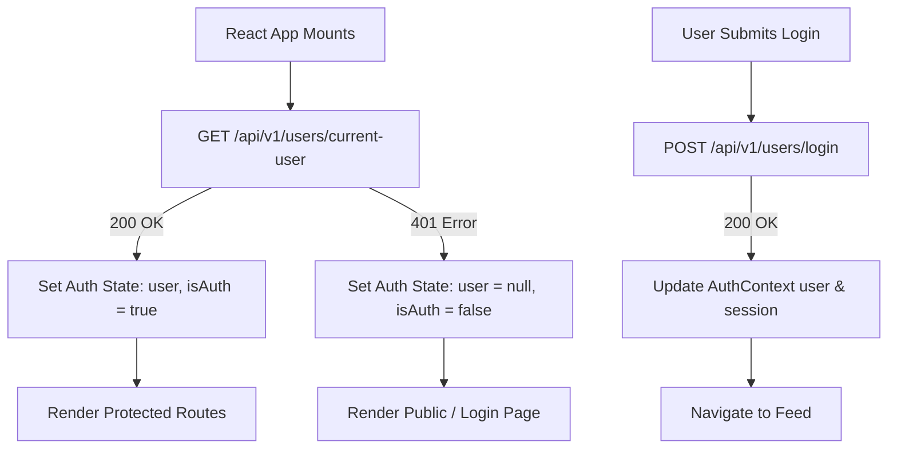

# 03 Frontend Architecture & Design Specification

> **Framework Choice**: React + Vite  
> **Styling System**: CSS Modules / Custom Design Tokens with Modern Vanilla CSS / Tailwind CSS  
> **State Architecture**: React Context API + Local Custom Hooks + Axios Client

---

## 1. Directory Structure Proposal

```
FoundrCast/
├── BACK-END/                   # Live Node.js/Express Backend (Protected)
└── frontend/                   # React Single Page Application (To Be Created)
    ├── public/
    │   └── favicon.ico
    ├── src/
    │   ├── api/                # API client modules mapping to backend routes
    │   │   ├── axiosClient.js  # Base Axios instance with credentials & interceptors
    │   │   ├── auth.api.js     # User & authentication API services
    │   │   ├── video.api.js    # Video CRUD & view counter services
    │   │   ├── comment.api.js  # Comments API services
    │   │   ├── like.api.js     # Like toggle & liked videos services
    │   │   ├── sub.api.js      # Subscription services
    │   │   ├── playlist.api.js # Playlist CRUD services
    │   │   ├── tweet.api.js    # Community tweets services
    │   │   └── dashboard.api.js# Studio analytics & video management
    │   ├── assets/             # Branding icons, images, badges
    │   ├── components/         # Reusable UI component primitives
    │   │   ├── common/         # Buttons, Inputs, Modals, Toasts, Skeletons, Badges
    │   │   ├── layout/         # Navbar, Sidebar, PageContainer, Header
    │   │   ├── video/          # VideoCard, VideoGrid, VideoPlayer, ViewCounter
    │   │   ├── comment/        # CommentItem, CommentInput, CommentList
    │   │   ├── channel/        # ChannelHeader, ChannelTabs, SubscribeBtn
    │   │   └── dashboard/      # StatCard, VideoTable, UploadModal
    │   ├── context/            # React Context Providers
    │   │   ├── AuthContext.jsx # Auth state, user session, login/logout actions
    │   │   └── ToastContext.jsx# Global toast notification queue
    │   ├── hooks/              # Custom React hooks
    │   │   ├── useAuth.js      # Easy access to AuthContext
    │   │   ├── useToast.js     # Trigger notification toasts
    │   │   ├── useDebounce.js  # Search input debouncing
    │   │   └── useInfiniteScroll.js # Pagination trigger hook
    │   ├── pages/              # Page view components
    │   │   ├── HomePage.jsx          # Public feed & topic query filtering
    │   │   ├── WatchPage.jsx         # Video player, comments, metadata
    │   │   ├── SearchPage.jsx        # Video search results
    │   │   ├── ChannelPage.jsx       # Channel header, videos, playlists, community
    │   │   ├── DashboardPage.jsx     # Creator studio analytics & table
    │   │   ├── PlaylistsPage.jsx     # User playlists grid & detail
    │   │   ├── HistoryPage.jsx       # Watch history page
    │   │   ├── LikedVideosPage.jsx   # Liked videos library
    │   │   ├── LoginPage.jsx         # Auth login form
    │   │   ├── RegisterPage.jsx      # Auth signup & avatar upload form
    │   │   └── NotFoundPage.jsx      # 404 screen
    │   ├── utils/              # Helper utilities
    │   │   ├── formatters.js   # Duration (sec -> mm:ss), Views (1.2k), Date ago
    │   │   └── validators.js   # Form validation helpers
    │   ├── App.jsx             # Router layout & context providers wrapper
    │   ├── index.css           # Global design system tokens & baseline styles
    │   └── main.jsx            # React root mount
    ├── package.json
    └── vite.config.js
```

---

## 2. API Client Architecture (`axiosClient.js`)

The frontend utilizes a single, centralized Axios instance (`axiosClient`) configured to handle cross-origin cookies, request header injection, response envelope unwrapping, and automatic JWT token refresh.

```javascript
// src/api/axiosClient.js
import axios from "axios";

const API_BASE_URL = import.meta.env.VITE_API_BASE_URL || "http://localhost:8000/api/v1";

export const axiosClient = axios.create({
  baseURL: API_BASE_URL,
  withCredentials: true, // MANDATORY for cookie transfer (accessToken, refreshToken)
  headers: {
    "Content-Type": "application/json",
  },
});

// Response Interceptor: Normalize responses & catch 401 for token refresh
let isRefreshing = false;
let failedQueue = [];

const processQueue = (error, token = null) => {
  failedQueue.forEach((prom) => {
    if (error) {
      prom.reject(error);
    } else {
      prom.resolve(token);
    }
  });
  failedQueue = [];
};

axiosClient.interceptors.response.use(
  (response) => response.data, // Automatically unwrap Express response payload
  async (error) => {
    const originalRequest = error.config;

    // Handle 401 Unauthorized (Expired Access Token)
    if (error.response?.status === 401 && !originalRequest._retry && originalRequest.url !== "/users/login" && originalRequest.url !== "/users/refresh-token") {
      if (isRefreshing) {
        return new Promise((resolve, reject) => {
          failedQueue.push({ resolve, reject });
        })
          .then(() => axiosClient(originalRequest))
          .catch((err) => Promise.reject(err));
      }

      originalRequest._retry = true;
      isRefreshing = true;

      try {
        await axiosClient.post("/users/refresh-token");
        isRefreshing = false;
        processQueue(null);
        return axiosClient(originalRequest);
      } catch (refreshError) {
        isRefreshing = false;
        processQueue(refreshError, null);
        // Force client logout if refresh token is invalid/expired
        window.dispatchEvent(new CustomEvent("auth:unauthorized"));
        return Promise.reject(refreshError);
      }
    }

    // Extract ApiError payload message if present
    const errorMessage = error.response?.data?.message || error.message || "An unexpected error occurred";
    return Promise.reject(new Error(errorMessage));
  }
);
```

---

## 3. Auth State Management (`AuthContext.jsx`)

The session state is managed via React Context. At app boot, `AuthContext` pings `/api/v1/users/current-user` to check for active authenticated sessions.



### Context State Structure
- `user` (Object | null): Logged-in user object (`_id`, `username`, `email`, `fullName`, `avatar`, `coverImage`).
- `isAuthenticated` (Boolean): Derived from `!!user`.
- `loading` (Boolean): True during initial session bootstrap check.
- `login(credentials)`: Calls `/users/login` and updates `user`.
- `logout()`: Calls `/users/logout` and resets state.
- `updateUser(updatedFields)`: Updates local user details in context when profile/avatar is edited.

---

## 4. Media & Upload Handling Strategy

### 4.1 Video Player Component
- Custom HTML5 Video player wrapper or lightweight Video.js layer.
- Listens to playback start to send a `POST /api/v1/videos/view/:videoId` view count increment request once per video load session.
- Handles Cloudinary video URL streaming seamlessly.

### 4.2 File Uploads with Progress State
- Multipart uploads (`Publish Video`, `Update Avatar`, `Update Cover`) use Axios `onUploadProgress` to calculate upload completion percentage (0% - 100%).
- Displays real-time progress bars to the user during large video uploads to Cloudinary via backend temporary buffering.

```javascript
// Example File Upload Handler in video.api.js
export const publishVideo = async (formData, onProgress) => {
  return axiosClient.post("/videos", formData, {
    headers: {
      "Content-Type": "multipart/form-data",
    },
    onUploadProgress: (progressEvent) => {
      const percentCompleted = Math.round(
        (progressEvent.loaded * 100) / progressEvent.total
      );
      if (onProgress) onProgress(percentCompleted);
    },
  });
};
```

---

## 5. UI Component & UX Strategy

### Core Design System Components
1. **Button**: Primary (Vibrant Magenta/Cyan gradient), Secondary (Glass outline), Danger (Crimson), Ghost. Supports `isLoading` spinner state.
2. **Input / Form Control**: Dark surface, sharp focus ring, validation error indicator, helper text.
3. **Modal Component**: Glassmorphism backdrop blur, accessible keyboard esc/focus trap, smooth fade & scale entry animation.
4. **VideoCard Component**: Modern card layout showing thumbnail preview, video duration badge (`mm:ss`), creator avatar, title, channel name, views count, and publish timestamp (`3 days ago`).
5. **Skeleton Loaders**: Animated pulse cards for video grid loading, comment list loading, and channel header loading.
6. **Toast Notification System**: Stacked toast alerts for `success`, `error`, `info`, and `warning` feedback messages.
7. **EmptyState Component**: Illustrated vector icon, friendly message, and call-to-action button when data arrays are empty.

---

## 6. Route & Protection Architecture

| Path | Layout | Protection Level | Access Rule |
|---|---|---|---|
| `/` | MainLayout | Public / Optional Auth | All users |
| `/login` | AuthLayout | Guest Only | Redirect to `/` if logged in |
| `/register` | AuthLayout | Guest Only | Redirect to `/` if logged in |
| `/watch/:videoId` | MainLayout | Protected | Requires `verifyJWT` session |
| `/search` | MainLayout | Protected | Requires `verifyJWT` session |
| `/c/:username` | MainLayout | Protected | Requires `verifyJWT` session |
| `/dashboard` | StudioLayout | Protected (Creator) | Requires `verifyJWT` session |
| `/playlists` | MainLayout | Protected | Requires `verifyJWT` session |
| `/playlists/:playlistId` | MainLayout | Protected | Requires `verifyJWT` session |
| `/history` | MainLayout | Protected | Requires `verifyJWT` session |
| `/liked-videos` | MainLayout | Protected | Requires `verifyJWT` session |
