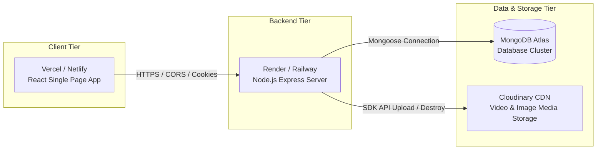

# 06 Deployment Plan & Architecture Audit

> **Status**: Planning & Architecture Phase. **NO deployment operations performed yet**.

---

## 1. Environment Variable Audit

### Backend Production Environment Variables (`BACK-END/.env`)

| Variable Name | Description | Example Production Value |
|---|---|---|
| `PORT` | Server listening port | `8000` or `process.env.PORT` |
| `MONGODB_URI` | MongoDB Connection String | `<MONGODB_ATLAS_CONNECTION_STRING>` |
| `ACCESS_TOKEN_SECRET` | Secret key for signing Access JWTs | `<GENERATE_SECURE_RANDOM_SECRET>` |
| `ACCESS_TOKEN_EXPIRY` | Expiry duration for Access Tokens | `1d` |
| `REFRESH_TOKEN_SECRET` | Secret key for signing Refresh JWTs | `<GENERATE_SECURE_RANDOM_SECRET>` |
| `REFRESH_TOKEN_EXPIRY` | Expiry duration for Refresh Tokens | `10d` |
| `CLOUDINARY_CLOUD_NAME` | Cloudinary account cloud name | `foundrcast-cloud` |
| `CLOUDINARY_API_KEY` | Cloudinary API Key | `<CLOUDINARY_API_KEY>` |
| `CLOUDINARY_API_SECRET` | Cloudinary API Secret | `<CLOUDINARY_API_SECRET>` |
| `CORS_ORIGIN` | Allowed client origin URL for CORS | `https://foundrcast.vercel.app` |

### Frontend Production Environment Variables (`frontend/.env.production`)

| Variable Name | Description | Production Value |
|---|---|---|
| `VITE_API_BASE_URL` | Live backend API Base URL | `<PRODUCTION_BACKEND_URL>/api/v1` |

---

## 2. Infrastructure & Hosting Strategy



---

## 3. Storage, CORS & Cookie Configuration

### 3.1 MongoDB Atlas Setup
- Database cluster instance running MongoDB v6.0+.
- Production connection URI configured with connection pooling (`maxPoolSize: 10`).

### 3.2 Cloudinary Integration
- Resource types set to `"auto"` (handles images for avatars/thumbnails and videos for video files).
- Auto-deletes old Cloudinary media assets on user avatar/cover updates and video deletions (`deleteFromCloudinary(publicId)`).

### 3.3 CORS & Cross-Domain Cookie Handling
- `cors({ origin: process.env.CORS_ORIGIN, credentials: true })` ensures browser sends and receives HTTP-Only cookies cross-domain.
- **Mandatory Verification Protocol**: Before production deployment, the agent/developer must inspect the **ACTUAL** backend `res.cookie()` configuration in `BACK-END/src/` rather than assuming cookie attributes.
- **Frontend Adaptation Rule**: The frontend must adapt to the existing backend cookie/authentication behavior.
- **Backend Protection Rule**: Do **NOT** modify cookie settings, JWT configuration, authentication middleware, or any other backend authentication code merely to make frontend deployment work.
- **Explicit Approval Gate**: If a backend authentication or cookie change appears necessary, **STOP** and request explicit approval from the user before making any backend change.
- Production deployment requirements:
  - Frontend and backend served over `HTTPS`.
  - `CORS_ORIGIN` set strictly to exact production frontend origin (`https://foundrcast.vercel.app`).

### 3.4 File Upload Constraints & Temporary Storage
- Express body parsing set to `16kb` limit (`express.json({ limit: "16kb" })`).
- Multer uses local disk storage (`./public/temp`) for staging file uploads before transmitting to Cloudinary.
- **Server Deployment Requirement**: Server host filesystem must grant write permissions to `./public/temp` directory.

---

## 4. Production Hosting Options

### Backend Server Options
1. **Render.com / Railway.app** (Recommended): Native Node.js environment, automatic git deployments, environment secret management.
2. **Custom VPS (DigitalOcean / AWS EC2)**: PM2 process manager + Nginx reverse proxy with SSL certificate (Let's Encrypt).

### Frontend Hosting Options
1. **Vercel / Netlify**: Automated Vite SPA deployment, global CDN edge routing, client-side route rewrite rules (`/index.html`).

---

## 5. Pre-Deployment Verification Checklist

```markdown
- [ ] 1. MongoDB Atlas cluster created and IP whitelist configured (0.0.0.0/0 or VPC peering).
- [ ] 2. Cloudinary production bucket verified and storage quotas checked.
- [ ] 3. Production JWT secrets generated with high-entropy random keys.
- [ ] 4. Express CORS_ORIGIN updated to match exact production frontend domain.
- [ ] 5. Frontend VITE_API_BASE_URL set to HTTPS production backend route.
- [ ] 6. Local disk temp upload folder `./public/temp` verified.
- [ ] 7. End-to-end user authentication and cookie delivery tested over HTTPS.
- [ ] 8. Full production build of frontend (`npm run build`) verified clean without errors.
```
